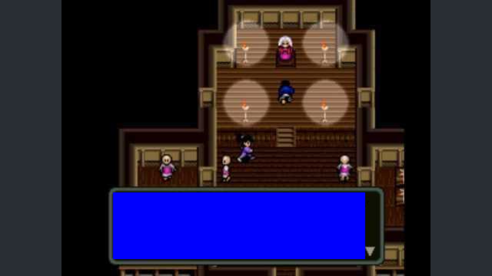
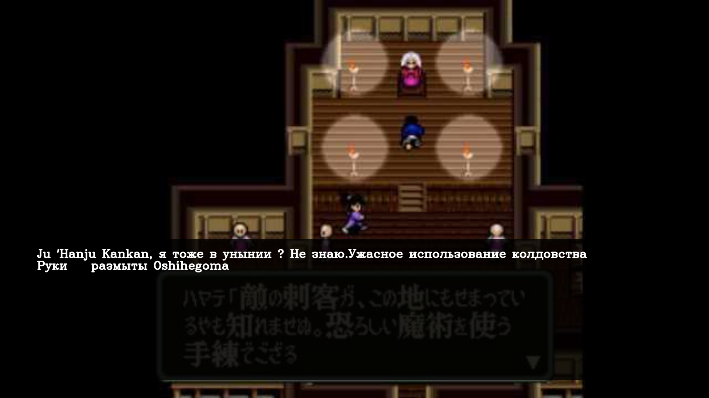

# Перевод текста в консольных инрах

Данный скрипт предназначен для перевода текста в диалогах консольгых игр.
Для работы требуется любое устройство захвата видео.

# Установка

Ниже приведён пример установки на Anaconda, так как он будет примерно одинаков для всех платформ.

    conda install -c conda-forge opencv googletrans textwrap pyaudio difflib
    conda install -c conda-forge tensorflow tesseract pytesseract
    conda install -c conda-forge tesseract-ocr-rus tesseract-ocr-eng tesseract-ocr-jpn

Если предполагается использование нейросети SRGAN для увеличения разрешения текста перед
распознаванием, необходимо также скачать предобученную модель по [ссылке](https://tfhub.dev/captain-pool/esrgan-tf2/) и распаковать её в папку esrgan рядом со скриптом.

## Настройка

Настройка рассмотрена на примере строк файла параметров.

### Параметры перевода

    # 3-буквенное обозначение языка оригинала для OCR Tesseract
    "language_from_tesseract": "eng",
    # 2-буквенное обозначение языка оригинала для Google Translate
    "language_from_translate": "en",
    # 2-буквенное обозначение выходного языка для Google Translate
    "language_to": "ru",
    # Флаг использования нейросети SRGAN
    "use_srgan": false,

Вот примеры 2-буквенных и 3-буквенных обозначений языков:

- en eng
- ja jpn
- ru rus

Использование нейросети SRGAN в ряде случаев необходимо.
Например, при переводе старых игр в низком разрешении на японском языке.
Иначе просто не получается. Однако, SRGAN работает довольно долго, что
плохо сказывается на игровом опыте. Сначала проверяйте необходимость, а
включайте только потом.

### Параметры видео

    # Индекс устройства захвата. Чаще всего имеет значение от 0, 1 или 2.
    "video_device_index": 0,
    # Выходное разрешения полноэкранного окна, где бут отрисовано изображение
    "output_width": 1920,
    "output_height": 1080,
    # Отступы от краёв экрана для зоны вывода перевода.
    "border": 50,

О способе определения значения параметра video_device_index будет сказано в разделе "Запуск и управление".

### Параметры аудио

    # Часть имени устройства захвата аудио.
    "audio_device_pattern": "USB Audio",
    # Количество каналов в входном и выходном потоке аудио.
    "channels": 2

О способе определения значения параметра audio_device_pattern будет сказано в разделе "Запуск и управление".

## Запуск и управление

Перед первым запуском рекомендуется запустить вспомогательный скрипт audio-devices.py,
чтобы найти своё устройство захвата и заполнить соответствующие поля настроек.
Однако индекс устройства захвата видео в любом случае будет от 0 до 2 в случае использования
USB устройства. В случае использования сетевых устройств, индекс может принимать и большие значения.

После запуска hdmi-translate.py открывается полноэкранное окно с захваченным изображением, а звук
с устройства захвата выводится на стандартные динамики.

- Выход из программы осуществляется с помошью клавиши Q (следите за выбранной локализацией ввода).
- Перевод текста на изображении осуществляется с помощью клавиши "пробел".

По умолчанию переводится весь экран, однако это может являться одной из причин ухудшения качества перевода.
Чаще всего текст в играх расположен в предсказуемой зоне.
Для выделения этой зоны нажмите левой кнопкой мыши в левом верхнем углу зоны текста.
При этом на экране начнёт отрисовываться прямоугольник синего цвета.

Второе нажатие левой кнопкой мыши нужно сделать в правом нижнем углу зоны текста.
Так можно по необходимости выделять и отдельные кнопки.
От запуска к запуску прямоугольник перевода не сохраняется.

При нажатии клавиши "пробел" изображение прекратит обновляться до завершения процесса перевода.
После получения перевода отобразится полупрозрачный оверлей с переводом.

При повторном нажатии клавиши "пробел" он пропадёт.

# Приятной иры!
